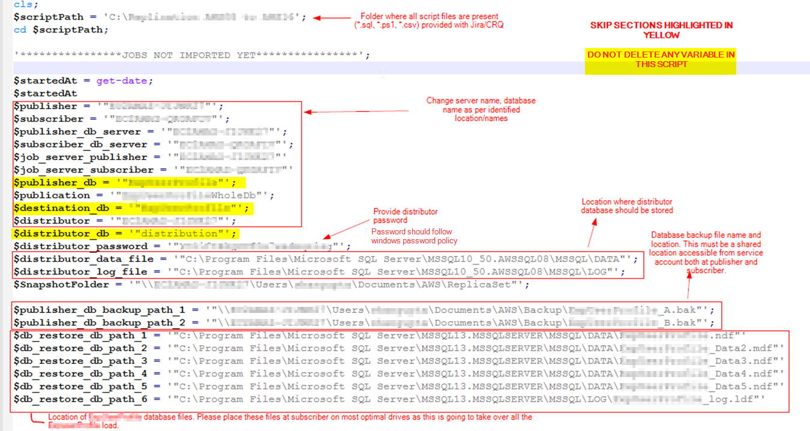
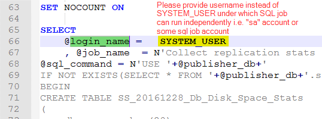
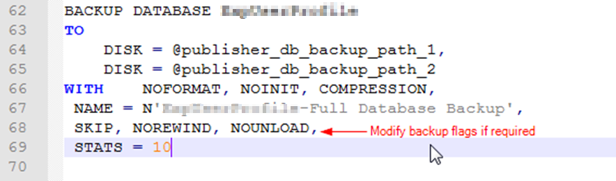
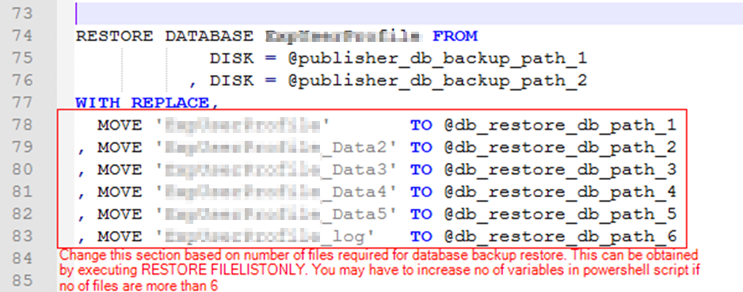
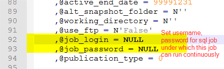
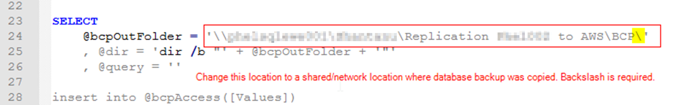
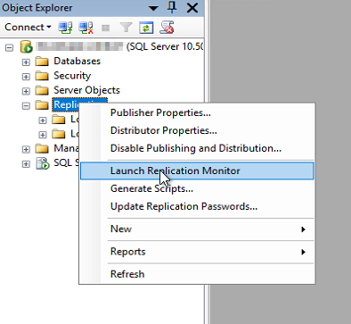
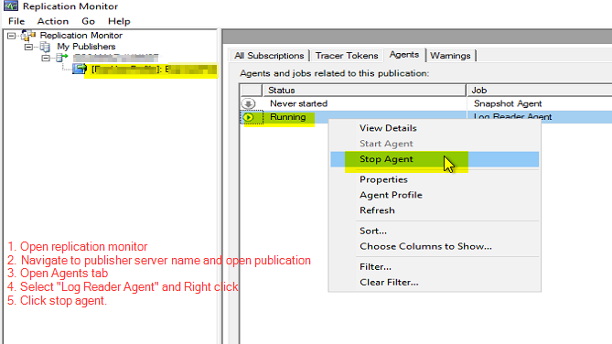

## Change data type change of Primary key column in SQL Server

I used this approach to migrate our business-critical database from SQL Server 2008 to SQL Server 2016 while changing the data type of primary key column having deep penetration in the database itself. 

### Primary objective
Ideally no downtime/downtime of a millisecond(CNAME change)

### Overview
In this approach we do set up replication between two SQL Server instances - the primary(publisher) & secondary(subscriber) to perform datatype change.

<details open><summary> Checklist </summary>

- Publisher and Subscriber services must be running on same service account
    - SQL Server Agent
    - SQL Server instance
    - SQL Server Browser
- A shared location i.e. network location is required(Database backup will be copied here)
    - Assign Read/Write permission to service account on this folder.
    - Enough storage space is available 
- Service account must be a member of sysadmin role in SQL Server
- Xp_cmdshell must be enabled on Publisher as well as Subscriber
- Xp_cmdshell must have read/write access to shared location
- Ensure there is no distribution database on Publisher
- Powershell is available on the machine from where implementation steps will be executed
- Change execution policy of Powershell to “RemoteSigned” by starting powershell in admin mode. To change execution policy run a command “Set-ExecutionPolicy RemoteSigned”. To view current execution policy, run a command “Get-ExecutionPolicy”  
- A shared location i.e. network location is required for bcp between publisher and subscriber
a.	Assign Read/Write permission to service account on this folder.
- Service account of publisher SQL Server on which SQL Server service is running must have read/write permissions to network folder used in step 1.

- Replicate all the logins of publisher on Subscriber
    ```
    SELECT dp.type_desc, dp.SID, dp.name AS user_name
    FROM sys.database_principals AS dp  
    LEFT JOIN sys.server_principals AS sp  
        ON dp.SID = sp.SID  
    WHERE sp.SID IS NULL  
    ```

</details>

<details open><summary> Pre steps </summary>

> Files to modify before deployment

1. Modify [Execute_all_steps.ps1](Execute_all_steps.ps1)
    - DO NOT DELETE ANY VARIABLE FROM THE SCRIPT.
    - When setting password in distribution_password variable, please ensure password is in compliance with windows password policy.
  
    

2. [01_SQL_job_for_stats_collection_On_Publisher.sql](1_Setup%20replication/01_SQL_job_for_stats_collection_On_Publisher.sql) and replace @login_name variable value to a valid login account under which SQL job can run independently


3. [02_SQL_job_for_stats_collection_On_Subscriber.sql](1_Setup%20replication/02_SQL_job_for_stats_collection_On_Subscriber.sql) and replace @login_name variable value to a valid login account under which SQL job can run independently


4. [35_Publisher_Backup.sql](1_Setup%20replication/35_Publisher_Backup.sql)


5. [40_Restore_published_database_to_subscriber.sql](1_Setup%20replication/40_Restore_published_database_to_subscriber.sql)


6. Change login in the file [50_NewSubscription.sql](1_Setup%20replication/50_NewSubscription.sql)



7. [65_Reseed_Identity_on_publisher_ExpUser.sql](3_Switch%20server/65_Reseed_Identity_on_publisher.sql)
   

8. [66_Reseed_Identity_on_subscriber_ExpUser.sql](3_Switch%20server/66_Reseed_Identity_on_subscriber.sql)
   

Right click on “Execute_all_steps.ps1” and select “Run with Powershell” 

</details>

<details open><summary> 1. Setup Replication </summary>
<p>

Following scripts are executed in sequence

1. [01_SQL_job_for_stats_collection_On_Publisher.sql](1_Setup%20replication/01_SQL_job_for_stats_collection_On_Publisher.sql) - Job is set up to collect database file size of publisher DB as well as tempdb.
   
2. [02_SQL_job_for_stats_collection_On_Subscriber.sql](1_Setup%20replication/02_SQL_job_for_stats_collection_On_Subscriber.sql) - Job is set up to collect database file size of subscriber DB as well as tempdb
   
3. [05_Cleanup_Subscriber.sql](1_Setup%20replication/05_Cleanup_Subscriber.sql) - Drops subscription on subscriber. The subscription type is pull-based.
   
4. [10_Cleanup_Publisher.sql](1_Setup%20replication/10_Cleanup_Publisher.sql) - Drops subscription if found. Drop publication, disable replication option on DB. Remove published jobs at the distributor server and then remove the distributor. The assumption is distributor is residing on the same server where the publisher database is present.
   
5. [15_ConfigureDistribution.sql](1_Setup%20replication/15_ConfigureDistribution.sql) - Setup distributor requires - adding distriutor to sysserver using *sp_adddistributor*. Adding distributor database. Register publisher to distributor
   
6. [20_Configure_Distributor_Properties.sql](1_Setup%20replication/20_Configure_Distributor_Properties.sql) - Add UIProperties table, Add snapshot folder, add publisher to distributor
   
7. [25_CreatePublication.sql](1_Setup%20replication/25_CreatePublication.sql) - Mark database as publisher. Configure transaction replication on publisher database along with sync and other parameters. *Add publication snapshot* - At this point, database backup would know an exact LSN from where data replication should be done on the subscriber whenever any subscriber database registers itself for this publisher.
   
8. [30_Add_Articles_To_Publisher.sql](1_Setup%20replication/30_Add_Articles_To_Publisher.sql) - Add articles(tables) on the publisher that would be replicated once the replication process begins i.e. subscriber is ready.
   
9.  [35_Publisher_Backup.sql](1_Setup%20replication/35_Publisher_Backup.sql) - Since the publisher is all set and the publisher has configured all the articles that would be available for sync, database backup can be taken at this point.
    
10. [40_Restore_published_database_to_subscriber.sql](1_Setup%20replication/40_Restore_published_database_to_subscriber.sql) - As the name suggests, restore database backup of the previous step on subscriber DB.
    
11. [45_Add_subscriber_to_publisher.sql](1_Setup%20replication/45_Add_subscriber_to_publisher.sql) - Add pull subscription on the publisher. This tells the publisher to which server it should start replication.
    
12. [50_NewSubscription.sql](1_Setup%20replication/50_NewSubscription.sql) - This script is executed on the publisher. Add pull subscription on the subscriber. This tells the subscriber who is the publisher. This script also configures the subscription agent.
    
13. [55_Mark_Not_For_Replication_On_Subscriber.sql](1_Setup%20replication/55_Mark_Not_For_Replication_On_Subscriber.sql) - If a table contains an identity column, we need to tell subscribers that the value for the identity column would be coming from replication and SQL Server should not try autogenerating a value for this column.

At this point, our 1st phase of overall datatype change has been completed. All the issues should be resolved up to this point to move forward.
</p>
</details>

<details open><summary> 2. Change datatype </summary>

1. [Truncate_table_on_publisher.sql](2_Data%20type%20change/Truncate_table_on_publisher.sql) - Truncate table which contains database file size information
   
2. [Truncate_table_on_subscriber.sql](2_Data%20type%20change/Truncate_table_on_subscriber.sql) - Truncate table which contains database file size information
   
3. [60_Change_datatype_on_subscriber.sql](2_Data%20type%20change/60_Change_datatype_on_subscriber.sql) - Perform all database related activities like data type change, FK, PK creation, index creation, stats update, etc on subscriber since it's still not taking any load. During table locking or other operations, the replication log would grow and as soon as this DB would be ready after changes, replication would eventually pick up and this DB would get synced up with publisher DB.
</details>

<details open><summary> 3. Switch database server(CNAME change)</summary>

1. [65_Reseed_Identity_on_publisher.sql](3_Switch%20server/65_Reseed_Identity_on_publisher.sql) - In this step, we get the identity value that needs to be set on the subscriber just before cutover so that post cutover, identity values don't create a conflict causing few records to fail in replication. Here we are trying to get the identity column's value that to be set on a subscriber by pulling no of records created in the last 3 days i.e. `COUNT(no_of_records_created_in_3_days)*3 + current_identity_value`. This logic is used for all the tables having identity value. Export this data to a subscriber and play this data on the subscriber.
   
2. [66_Reseed_Identity_on_subscriber.sql](3_Switch%20server/66_Reseed_Identity_on_subscriber.sql) - Reseed identity values generated from previous step.
   
3. [70_Enable_cdc_on_subscriber.sql](3_Switch%20server/70_Enable_cdc_on_subscriber.sql) - This step is only required if the Rollback strategy has to be planned. This approach is not as reliable as the above and should be used cautiously. In this approach, we are going to enable CDC on subscriber and post cutover any records changed will be logged into CDC tables. At the time of rollback, the same data will be exported using BCP and will be played back on the publisher server after stopping replication
</details>

<details open><summary> 4. Rollback </summary>

1. [72_Drop_SQL_job_for_stats_collection_On_Publisher.sql](4_Rollback/72_Drop_SQL_job_for_stats_collection_On_Publisher.sql) - Drop SQL job created in [01_SQL_job_for_stats_collection_On_Publisher.sql](1_Setup%20replication/01_SQL_job_for_stats_collection_On_Publisher.sql)
   
2. [73_Drop_SQL_job_for_stats_collection_On_Subscriber.sql](4_Rollback/73_Drop_SQL_job_for_stats_collection_On_Subscriber.sql) - Drop SQL job created in [02_SQL_job_for_stats_collection_On_Subscriber.sql](1_Setup%20replication/02_SQL_job_for_stats_collection_On_Subscriber.sql)
   
3. [74_Cleanup_Subscriber.sql](4_Rollback/74_Cleanup_Subscriber.sql) - Drop subscription on subscriber as a part of the cleanup process.
4. [75_Cleanup_Publisher.sql](4_Rollback/75_Cleanup_Publisher.sql) - Drop subscription on the publisher as a part of the cleanup process.
5. [78_bcp_cdc_changes_on_subscriber.sql](4_Rollback/78_bcp_cdc_changes_on_subscriber.sql) - Generate delta captured via CDC post-migration. This is the differential data that came to subscriber node post cutover and is not available on the publisher. This data can be dumped into CSV files, moved to publisher nodes, and loaded back in sequence onto publisher tables. This step will generate all of the files along with the sequence in which data has to be inserted. 
6. [80_bcp_restore_cdc_changes_on_publisher.sql](4_Rollback/80_bcp_restore_cdc_changes_on_publisher.sql) - This script creates a staging table where BCP data from the previous step is loaded into. Data from these tables would be moved to the final destination.
7. [85_restore_delta_to_publisher.sql](4_Rollback/85_restore_delta_to_publisher.sql) - Play staging data to publisher node.
8. [90_Reseed_Identity_on_subscriber.sql](4_Rollback/90_Reseed_Identity_on_subscriber.sql) - Same as 3.1 with identity values generated from a subscriber and played back on the publisher
9.  [92_Reseed_Identity_on_publisher.sql](4_Rollback/92_Reseed_Identity_on_publisher.sql) - Same as 3.2 with identity values generated from a subscriber and played back on the publisher

</details>

<details open><summary>5. Powershell scripts used to run this migration</summary>

1. [Generate_Sql_script.sql](Generate_Sql_script.ps1) - This script is used to generate SQL script for creating articles for replication. This file requires an input file containing table names for which article script needs to be generated.
   
2. [Execute_all_steps.ps1](Execute_all_steps.ps1) -  This script passes all the parameters as command-line arguments while calling SQL scripts from sqlcmd. All server names, database names etc need to be set in this file.
   
3. [Rollback.ps1](Rollback.ps1) - Not yet completed
   
4. [AWS_New_Instance_Configure.ps1](AWS_New_Instance_Configure.ps1) - This script was used to add an EC2 instance to a domain.
   </details>

<details open><summary>Monitoring replication monitor</summary>
<p>

Open replication monitor to track status of replication log i.e. delay in replicating the data from publisher to subscriber.



</p>
</details>